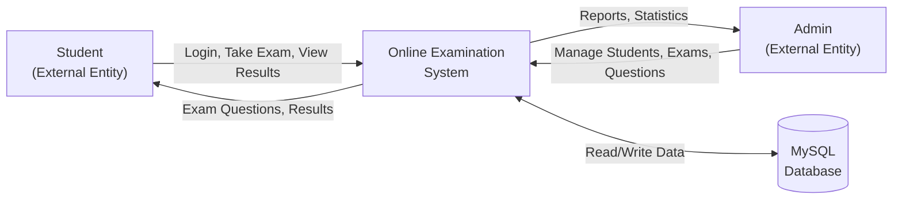
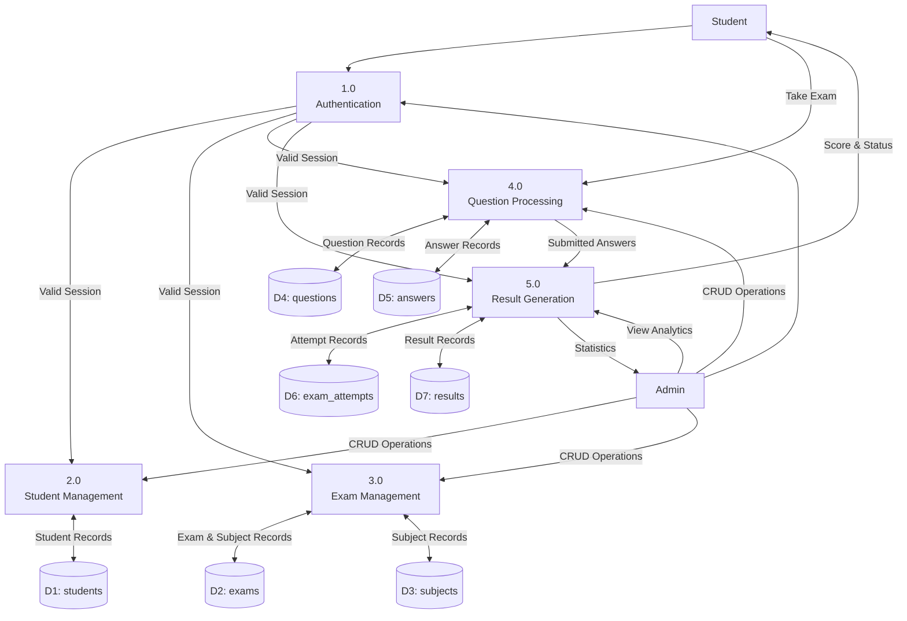

# Data Flow Diagrams — Online Examination System

## DFD Level 0 (Context Diagram)

## DFD Level 1 (Detailed Data Flow)

### Process Descriptions

| Process | Description |
|---------|-------------|
| 1.0 Authentication | Validates user credentials, creates sessions, handles login/logout |
| 2.0 Student Management | Admin adds/edits/deletes students; students update their profiles |
| 3.0 Exam Management | Admin creates exams linked to subjects with duration and pass criteria |
| 4.0 Question Processing | Admin manages MCQ questions; students answer questions during exams |
| 5.0 Result Generation | Calculates scores, determines pass/fail, generates statistics |
