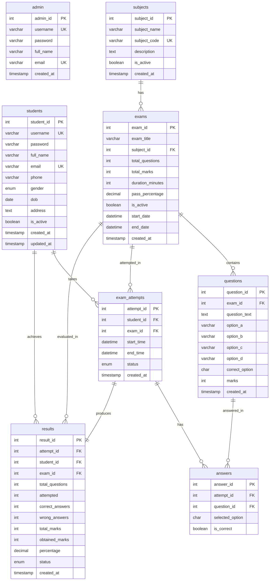

# ER Diagram — Online Examination System

```mermaid
erDiagram
    admin {
        int admin_id PK
        varchar username UK
        varchar password
        varchar full_name
        varchar email UK
        timestamp created_at
    }

    students {
        int student_id PK
        varchar username UK
        varchar password
        varchar full_name
        varchar email UK
        varchar phone
        enum gender
        date dob
        text address
        boolean is_active
        timestamp created_at
        timestamp updated_at
    }

    subjects {
        int subject_id PK
        varchar subject_name
        varchar subject_code UK
        text description
        boolean is_active
        timestamp created_at
    }

    exams {
        int exam_id PK
        varchar exam_title
        int subject_id FK
        int total_questions
        int total_marks
        int duration_minutes
        decimal pass_percentage
        boolean is_active
        datetime start_date
        datetime end_date
        timestamp created_at
    }

    questions {
        int question_id PK
        int exam_id FK
        text question_text
        varchar option_a
        varchar option_b
        varchar option_c
        varchar option_d
        char correct_option
        int marks
        timestamp created_at
    }

    exam_attempts {
        int attempt_id PK
        int student_id FK
        int exam_id FK
        datetime start_time
        datetime end_time
        enum status
        timestamp created_at
    }

    answers {
        int answer_id PK
        int attempt_id FK
        int question_id FK
        char selected_option
        boolean is_correct
    }

    results {
        int result_id PK
        int attempt_id FK
        int student_id FK
        int exam_id FK
        int total_questions
        int attempted
        int correct_answers
        int wrong_answers
        int total_marks
        int obtained_marks
        decimal percentage
        enum status
        timestamp created_at
    }

    subjects ||--o{ exams : "has"
    exams ||--o{ questions : "contains"
    students ||--o{ exam_attempts : "takes"
    exams ||--o{ exam_attempts : "attempted_in"
    exam_attempts ||--o{ answers : "has"
    questions ||--o{ answers : "answered_in"
    exam_attempts ||--|| results : "produces"
    students ||--o{ results : "achieves"
    exams ||--o{ results : "evaluated_in"
```
